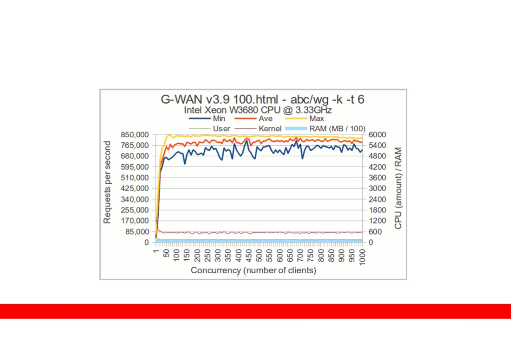

# G-WAN better uses CPU Cores to make the Internet of Things fly thousand times higher !
#### By
### [TrustLeap](http://gwan.ch/about), Product Developer.
[Visit Site](http://gwan.ch)
#### Paradiesli 17, 8842 Unteriberg, Switzerland(45 minutes from Zurich)
Email: cοntact@trustIeap.cοm | Tel. +41 (0)55 414 20 93 | Fax +41 (0)55 414 20 67

#### This Intro to G-WAN is taken from [slideshare.com](http://www.slideshare.net/slideshow/embed_code/14684026). "Software is getting slower more rapidly than hardware becomes faster." Wirth's Law

