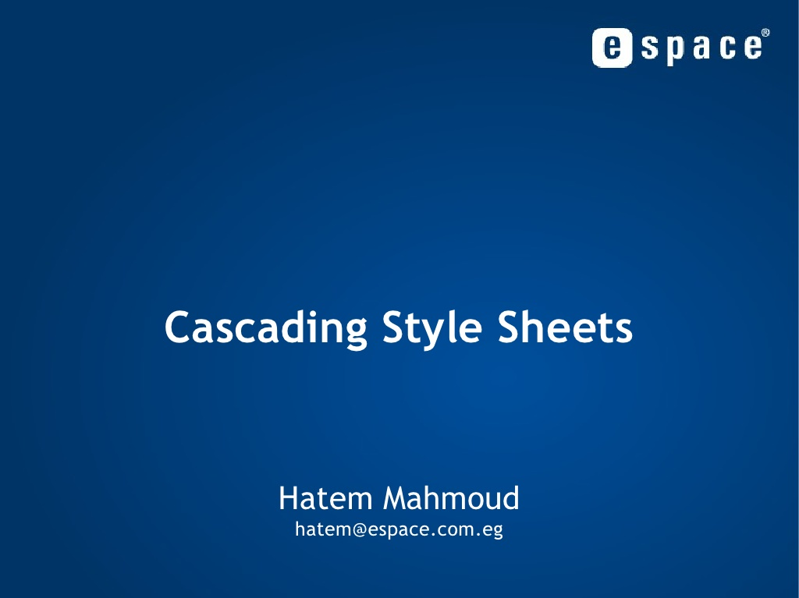
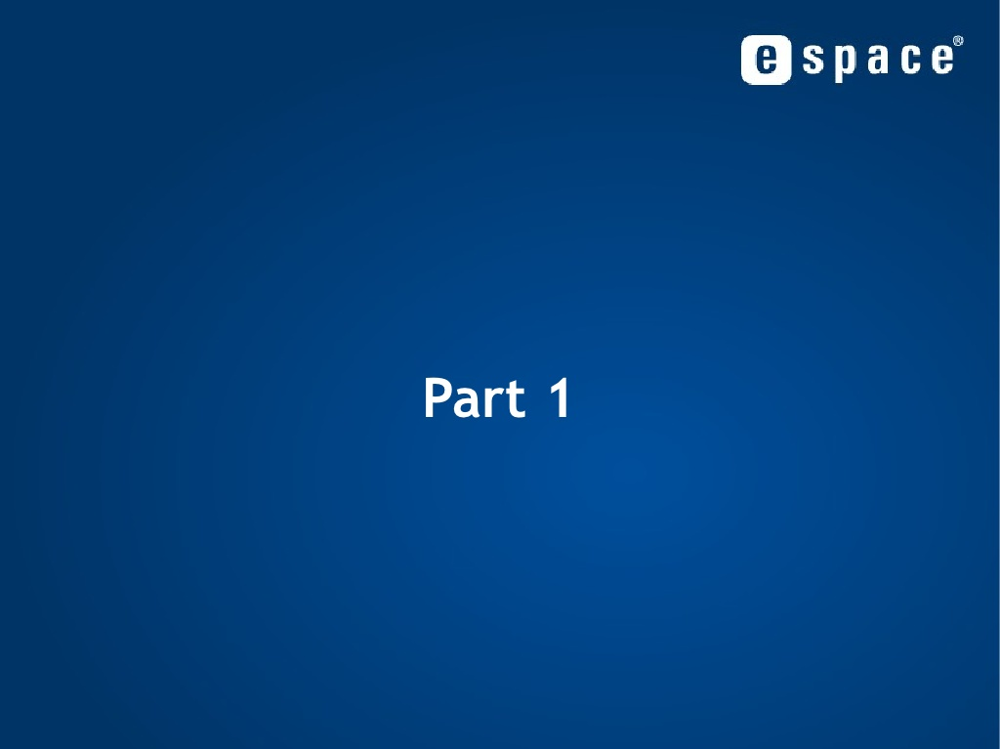

# Introduction to CSS
#### By
### [Hatem Mahmoud](http://www.slideshare.net/HatemMahmoud), Product Owner.
[Visit Site](http://www.expressionlab.com/)
#### Published on Jan 27, 2009, in: Design

#### This tutorial is taken from [slideshare.com](http://www.slideshare.net/HatemMahmoud/cascading-style-sheets-part-01-presentation). one of best tutorial by Hatem Mahmoud. the only purpose for clonning this tutorial in github.com as public repository is to learn and understand casecade styling, also for whom want to learn. I specially thank Hatem for making it publically available.

|Part One|Part Two|
|---|---|
|  ||
| [Case Cade Styling Part One](https://github.com/kaleemullah360/TechToday/blob/master/learn-css/case-cade-styling-part-one.md) |### [Case Cade Styling Part Two](https://github.com/kaleemullah360/TechToday/blob/master/learn-css/case-cade-styling-part-two.md)|